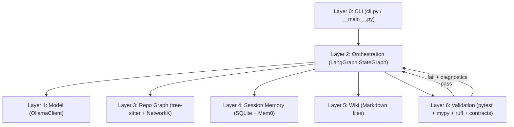
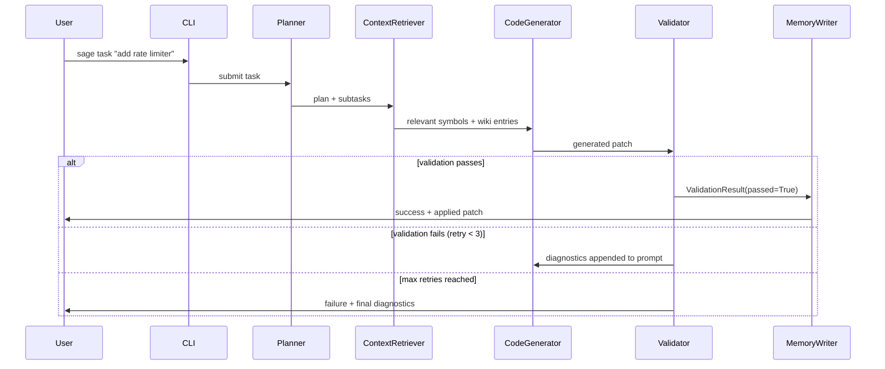

# Design Document — local-sage

## Overview

local-sage is a repo-aware, validation-gated coding agent that wraps Qwen2.5 Coder 7B (served by Ollama) with
structural understanding of a Python codebase, persistent session memory, an agent-maintained wiki, and a
deterministic validation gate. The core thesis is that small local models fail in predictable, structural ways;
local-sage catches those failures deterministically rather than relying on a larger model.

The system is organized into six discrete layers that communicate through well-defined interfaces. No layer
imports from a layer above it. The validation layer (Layer 6) is the most critical component and is treated
with extra care throughout this design.

### Design Goals

- **Correctness over speed**: every patch must pass pytest + mypy + ruff + contract checks before being applied.
- **Privacy**: zero outbound network calls except `localhost:11434`.
- **Consumer hardware**: 8 GB VRAM (RTX 3060), 16 GB system RAM.
- **Maintainability**: strict coding standards enforced at the design level (type hints, docstrings, 40-line
  function limit, pathlib, typed exceptions).

### Key Design Decisions

| Decision | Rationale |
|---|---|
| LangGraph for orchestration | Provides typed state, conditional edges, and retry loops without custom graph machinery |
| tree-sitter over `ast` module | Tolerates syntax errors, provides byte-accurate source spans, faster incremental re-parse |
| SQLite (stdlib) for session storage | Zero extra dependency, sufficient for single-user local tool |
| Mem0 with HuggingFace embedder | Avoids OpenAI dependency; `multi-qa-MiniLM-L6-cos-v1` fits in ~90 MB RAM |
| Temp-directory patching | Original files are never touched until all validators pass |
| Subprocess for pytest/mypy/ruff | Isolates tool environments; avoids import-time side effects |
| `whatthepatch` for diff application | Pure-Python, cross-platform; avoids `patch -p1` system dependency |
| Personalized PageRank for context selection | Principled graph-based ranking inspired by Aider's repomap.py; handles hub symbols naturally |

> ⚠️ **Validation layer (Layer 6) requires manual review before any implementation task is marked complete.**
> Do not auto-complete validation layer tasks. The ContractChecker is the novel contribution of this project
> and must be reviewed by a human before being accepted.

---

## Architecture

The system follows a layered architecture. Data flows top-down during a task execution and bottom-up during
context retrieval.



### Agent Execution Flow



### Dependency Graph (layer imports)

```
cli.py
  └── orchestration/graph.py
        ├── model/client.py
        ├── repo_graph/indexer.py, selector.py, impact.py
        ├── memory/session.py, semantic.py
        ├── wiki/manager.py
        └── validation/runner.py
              ├── validation/pytest_runner.py
              ├── validation/mypy_runner.py
              ├── validation/ruff_runner.py
              ├── validation/patcher.py
              └── validation/contracts.py
```

No circular imports. Each layer's `__init__.py` exports only its public API.

---

## Components and Interfaces

### Layer 0 — CLI (`local_sage/cli.py` + `local_sage/__main__.py`)

The CLI is a Typer application. All commands are thin wrappers that delegate to the appropriate layer.

#### Subcommands

| Command | Description |
|---|---|
| `sage start` | Boot the Agent, index the repo, load the latest session. Reports ready status. |
| `sage task "<description>"` | Run a coding task through the full agent loop. Streams progress via Rich. |
| `sage validate --patch <path>` | Run ValidationRunner on a patch file. Displays result. Never applies the patch. |
| `sage benchmark --suite <path>` | Run the eval benchmark suite and print pass rates. |
| `sage memory show` | Display current session memory in a Rich table. |
| `sage wiki list` | List all wiki entries with titles and last-modified timestamps. |
| `sage wiki show <entry>` | Display the full markdown content of a wiki entry. |
| `sage status` | Print a Rich panel showing: Ollama model online/offline, repo index stats (file count, symbol count, last indexed timestamp), and current session info (session ID, task count, last active). |

#### `sage status` detail

`sage status` is the first command a new user runs to verify their setup. It must:
1. Call `OllamaClient.health_check()` and display ✓ online / ✗ offline with the model name.
2. Load the `SymbolGraph` cache from `.sage/index.json` (if present) and display file count, symbol count,
   and last-indexed timestamp. If no cache exists, display "not indexed — run `sage start`".
3. Call `SessionManager.load_latest_session()` and display session ID, number of tasks completed, and
   last-active timestamp. If no session exists, display "no session — run `sage start`".

All output is formatted as a Rich `Panel` with sections for Model, Repo, and Session.

---

### Layer 1 — Model (`local_sage/model/`)

#### `OllamaClient` (`client.py`)

Async HTTP client wrapping the Ollama `/api/generate` endpoint.

```python
@dataclass
class ModelResponse:
    text: str
    tokens_used: int          # eval_count from Ollama response
    prompt_tokens: int        # prompt_eval_count
    finish_reason: str        # done_reason: "stop" | "length" | "error"
    duration_ms: int          # total_duration / 1_000_000

class OllamaClient:
    BASE_URL: ClassVar[str] = "http://localhost:11434"
    MODEL: ClassVar[str] = "qwen2.5-coder:7b-instruct-q4_K_M"
    TIMEOUT_SECONDS: ClassVar[int] = 120

    async def generate(self, prompt: str, system: str = "") -> ModelResponse: ...
    async def health_check(self) -> bool: ...
```

**Request format** (`POST /api/generate`):
```json
{
  "model": "qwen2.5-coder:7b-instruct-q4_K_M",
  "prompt": "<user prompt>",
  "system": "<system prompt>",
  "stream": false,
  "options": {"num_ctx": 8192}
}
```

**Response fields used**: `response` → `text`, `eval_count` → `tokens_used`,
`prompt_eval_count` → `prompt_tokens`, `done_reason` → `finish_reason`,
`total_duration` → `duration_ms`.

#### `exceptions.py`

```python
class OllamaError(Exception): ...
class OllamaConnectionError(OllamaError): ...   # httpx.ConnectError
class OllamaRequestError(OllamaError):          # non-200 HTTP
    status_code: int
    body: str
class OllamaTimeoutError(OllamaError): ...      # httpx.TimeoutException
```

---

### Layer 2 — Orchestration (`local_sage/orchestration/`)

#### `AgentState` (`state.py`)

```python
@dataclass
class AgentState:
    task: str
    plan: list[str]
    context_symbols: list[SymbolInfo]
    wiki_context: list[WikiEntry]
    patch: str | None
    validation_result: ValidationResult | None
    retry_count: int
    max_retries: int
    session_id: str
    error: str | None
```

`SymbolInfo` and `WikiEntry` are imported from their respective layers. `AgentState` is the single shared
object passed between all LangGraph nodes.

#### `graph.py` — StateGraph definition

```python
def build_graph() -> CompiledGraph:
    graph = StateGraph(AgentState)
    graph.add_node("planner", planner_node)
    graph.add_node("context_retriever", context_retriever_node)
    graph.add_node("code_generator", code_generator_node)
    graph.add_node("validator", validator_node)
    graph.add_node("memory_writer", memory_writer_node)

    graph.set_entry_point("planner")
    graph.add_edge("planner", "context_retriever")
    graph.add_edge("context_retriever", "code_generator")
    graph.add_edge("code_generator", "validator")
    graph.add_conditional_edges(
        "validator",
        route_after_validation,   # returns "code_generator" | "memory_writer" | END
    )
    graph.add_edge("memory_writer", END)
    return graph.compile()
```

**Routing logic** (`route_after_validation`):
- `passed=True` → `"memory_writer"`
- `passed=False` and `retry_count < max_retries` → `"code_generator"` (retry)
- `passed=False` and `retry_count >= max_retries` → `END` (report failure)

#### `nodes.py` — Node functions

Each node is a pure function `(state: AgentState) -> dict[str, Any]` returning only the fields it modifies.

| Node | Reads | Writes |
|---|---|---|
| `planner_node` | `task` | `plan` |
| `context_retriever_node` | `task`, `plan` | `context_symbols`, `wiki_context` |
| `code_generator_node` | `task`, `plan`, `context_symbols`, `wiki_context`, `validation_result`, `retry_count` | `patch`, `retry_count` |
| `validator_node` | `patch` | `validation_result` |
| `memory_writer_node` | `task`, `patch`, `validation_result`, `session_id` | (side effects only) |

#### `tools.py` — LangGraph tool definitions

```python
@tool
def read_file(path: str) -> str:
    """Read a file from the repository."""

@tool
def write_wiki(title: str, content: str) -> None:
    """Write or update a wiki entry."""

@tool
def run_tests(test_path: str | None = None) -> str:
    """Run pytest on the repository or a specific path."""
```

---

### Layer 3 — Repo Graph (`local_sage/repo_graph/`)

#### `RepoIndexer` (`indexer.py`)

Walks the repository, parses each `.py` file with tree-sitter, and populates the `SymbolGraph`.

```python
class RepoIndexer:
    def index_repo(self, repo_root: Path) -> SymbolGraph: ...
    def update_file(self, file_path: Path, graph: SymbolGraph) -> None: ...
    def save_index(self, graph: SymbolGraph, cache_path: Path) -> None: ...
    def load_index(self, cache_path: Path) -> SymbolGraph | None: ...
```

**tree-sitter usage**: `Language` loaded from `tree_sitter_python`, `Parser` configured with that language.
Queries extract:
- `function_definition` nodes → function name, start/end byte, parent class
- `class_definition` nodes → class name, start/end byte
- `import_statement` / `import_from_statement` nodes → imported names and modules
- `call` nodes → callee name (for call-edge construction)

Index is persisted as a JSON file at `<repo_root>/.sage/index.json`. On warm start, mtime of each `.py` file
is compared against the stored mtime; only changed files are re-parsed.

#### `SymbolGraph` (`graph.py`)

```python
@dataclass
class SymbolInfo:
    name: str
    kind: Literal["function", "class", "import"]
    file_path: Path
    start_byte: int
    end_byte: int
    start_line: int
    end_line: int
    source: str

class SymbolGraph:
    _graph: nx.DiGraph   # nodes: symbol_id (str), edges: "calls" | "imports"

    def add_symbol(self, symbol: SymbolInfo) -> None: ...
    def add_edge(self, from_id: str, to_id: str, kind: str) -> None: ...
    def get_symbol(self, symbol_id: str) -> SymbolInfo | None: ...
    def neighbors(self, symbol_id: str) -> list[SymbolInfo]: ...
    def to_dict(self) -> dict[str, Any]: ...
    @classmethod
    def from_dict(cls, data: dict[str, Any]) -> "SymbolGraph": ...
```

Node IDs are `"<relative_file_path>::<symbol_name>"` (e.g., `"local_sage/model/client.py::OllamaClient"`).

#### `ContextSelector` (`selector.py`)

```python
class ContextSelector:
    def select(
        self,
        task: str,
        graph: SymbolGraph,
        top_k: int = 10,
    ) -> list[SymbolInfo]: ...

    def _compute_personalization(
        self,
        task: str,
        graph: SymbolGraph,
    ) -> dict[str, float]: ...
```

Ranking uses **Personalized PageRank** on the `SymbolGraph`, directly inspired by Aider's `repomap.py`
([RepoMap blog post](https://aider.chat/2023/10/22/repomap.html)):

1. **Personalization vector**: task tokens are matched against symbol names and docstrings. Matching symbols
   receive a non-zero personalization weight; all others receive zero. This seeds the PageRank walk toward
   task-relevant nodes.
2. **PageRank**: `nx.pagerank(graph, personalization=personalization_vector, alpha=0.85)` propagates
   relevance through the call/import graph — symbols called by relevant symbols also score higher.
3. **Recency boost**: symbols modified in the current session have their PageRank score multiplied by a
   configurable `recency_factor` (default `1.5`) before final ranking.
4. **Top-K selection**: the top-K symbols by final score are returned with their `SymbolInfo` source spans.

This approach is more principled than BFS decay: PageRank naturally handles hub symbols (e.g., a utility
module imported by many files) and converges to a stable ranking rather than depending on traversal order.

#### `ImpactAnalyzer` (`impact.py`)

```python
class ImpactAnalyzer:
    def analyze(
        self,
        patch: str,
        graph: SymbolGraph,
    ) -> ImpactReport: ...

@dataclass
class ImpactReport:
    directly_modified: list[SymbolInfo]
    transitively_affected: list[SymbolInfo]
    affected_files: list[Path]
```

Parses the unified diff to extract modified symbol names, then performs a reverse BFS on the `SymbolGraph`
(following incoming "calls" and "imports" edges) to find all transitively affected symbols.

---

### Layer 4 — Session Memory (`local_sage/memory/`)

#### `SessionManager` (`session.py`)

```python
class SessionManager:
    def create_session(self, repo_path: Path) -> str: ...          # returns session_id
    def load_latest_session(self, repo_path: Path) -> Session | None: ...
    def record_task(self, session_id: str, task: str, patch: str, result: ValidationResult) -> None: ...
    def record_observation(self, session_id: str, observation: str) -> None: ...
    def get_session_summary(self, session_id: str) -> SessionSummary: ...
```

All SQL is written as parameterized queries using `sqlite3`. No ORM. The database file lives at
`<repo_root>/.sage/memory.db`.

#### `schema.sql`

```sql
CREATE TABLE IF NOT EXISTS sessions (
    id TEXT PRIMARY KEY,
    repo_path TEXT NOT NULL,
    created_at TEXT NOT NULL,
    updated_at TEXT NOT NULL
);

CREATE TABLE IF NOT EXISTS file_changes (
    id INTEGER PRIMARY KEY AUTOINCREMENT,
    session_id TEXT NOT NULL REFERENCES sessions(id),
    file_path TEXT NOT NULL,
    patch TEXT NOT NULL,
    applied_at TEXT NOT NULL
);

CREATE TABLE IF NOT EXISTS contracts_assumed (
    id INTEGER PRIMARY KEY AUTOINCREMENT,
    session_id TEXT NOT NULL REFERENCES sessions(id),
    symbol_id TEXT NOT NULL,
    contract_yaml TEXT NOT NULL
);

CREATE TABLE IF NOT EXISTS test_results (
    id INTEGER PRIMARY KEY AUTOINCREMENT,
    session_id TEXT NOT NULL REFERENCES sessions(id),
    passed INTEGER NOT NULL,
    failures TEXT,
    recorded_at TEXT NOT NULL
);

CREATE TABLE IF NOT EXISTS todos (
    id INTEGER PRIMARY KEY AUTOINCREMENT,
    session_id TEXT NOT NULL REFERENCES sessions(id),
    description TEXT NOT NULL,
    done INTEGER NOT NULL DEFAULT 0
);

CREATE TABLE IF NOT EXISTS decisions (
    id INTEGER PRIMARY KEY AUTOINCREMENT,
    session_id TEXT NOT NULL REFERENCES sessions(id),
    description TEXT NOT NULL,
    rationale TEXT,
    decided_at TEXT NOT NULL
);

CREATE TABLE IF NOT EXISTS wiki_entries (
    id INTEGER PRIMARY KEY AUTOINCREMENT,
    session_id TEXT NOT NULL REFERENCES sessions(id),
    title TEXT NOT NULL,
    file_path TEXT NOT NULL,
    written_at TEXT NOT NULL
);
```

#### `SemanticMemory` (`semantic.py`)

Wraps Mem0 configured with the HuggingFace embedder (sentence-transformers) and an in-process vector store.
**No OpenAI key is ever set or required.**

```python
MEM0_CONFIG = {
    "embedder": {
        "provider": "huggingface",
        "config": {
            "model": "multi-qa-MiniLM-L6-cos-v1",
            "embedding_dims": 384,
        },
    },
    "llm": {
        "provider": "ollama",
        "config": {
            "model": "qwen2.5-coder:7b-instruct-q4_K_M",
            "ollama_base_url": "http://localhost:11434",
        },
    },
    "vector_store": {
        "provider": "qdrant",
        "config": {"collection_name": "local_sage", "path": ".sage/vectors"},
    },
}

class SemanticMemory:
    def add_observation(self, text: str, user_id: str | None = None) -> None: ...
    def search(self, query: str, user_id: str | None = None, top_k: int = 5) -> list[str]: ...
```

`user_id` defaults to `sha256(str(repo_root))[:8]` — a stable, short identifier scoped to the current
repository. Callers should not need to supply it explicitly; `SemanticMemory.__init__` accepts `repo_root:
Path` and computes the default `user_id` once at construction time.

`multi-qa-MiniLM-L6-cos-v1` produces 384-dimensional embeddings and fits in ~90 MB RAM, well within the 2 GB
budget. The vector store uses Qdrant in local (on-disk) mode — no server required.

---

### Layer 5 — Wiki (`local_sage/wiki/`)

#### `WikiManager` (`manager.py`)

```python
@dataclass
class WikiEntry:
    title: str
    file_path: Path
    content: str
    last_modified: datetime

class WikiManager:
    def __init__(self, wiki_dir: Path) -> None: ...
    def write_entry(self, title: str, content: str) -> WikiEntry: ...
    def read_entry(self, title: str) -> WikiEntry: ...
    def list_entries(self) -> list[WikiEntry]: ...
    def search_entries(self, query: str) -> list[WikiEntry]: ...
```

Files are stored as `<wiki_dir>/<slug>.md` where `slug` is the title lowercased with spaces replaced by
underscores. `search_entries` uses simple token overlap (no external dependency). `WikiReadError` is raised
on filesystem failures.

```python
class WikiError(Exception): ...
class WikiReadError(WikiError):
    file_path: Path
    os_error: OSError
```

---

### Layer 6 — Validation (`local_sage/validation/`)

This is the most critical layer. All validation runs on a **temporary copy** of the repository. Original files
are never modified until all checks pass.

#### `ValidationResult` (`result.py`)

```python
@dataclass
class ValidationResult:
    passed: bool
    failures: list[ValidationFailure]
    pytest_counts: PytestCounts | None
    mypy_errors: list[MypyError] | None
    ruff_violations: list[RuffViolation] | None
    contract_failures: list[ContractFailure] | None
    duration_ms: int

    def to_retry_prompt(self) -> str:
        """Format failures as a prompt suffix for the code generator."""

@dataclass
class PytestCounts:
    passed: int
    failed: int
    errors: int

@dataclass
class MypyError:
    file_path: Path
    line: int
    column: int
    error_code: str
    message: str

@dataclass
class RuffViolation:
    file_path: Path
    line: int
    column: int
    rule_code: str
    message: str

@dataclass
class ContractFailure:
    symbol_id: str
    constraint: str
    actual: str
```

#### `Patcher` (`patcher.py`)

```python
class Patcher:
    def apply_to_temp(self, repo_root: Path, patch: str) -> Path:
        """Copy repo to a temp dir, apply patch, return temp dir path."""

    def apply_to_repo(self, repo_root: Path, patch: str) -> None:
        """Apply patch to the real repo. Only called after all validators pass."""

    def revert(self, temp_dir: Path) -> None:
        """Clean up the temp directory."""
```

`apply_to_temp` uses `shutil.copytree` to create a full copy, then applies the unified diff using
`whatthepatch` (pure-Python, `pip install whatthepatch`) as the primary applier. The system `patch -p1`
utility is **not** used — `whatthepatch` is cross-platform and avoids the Windows/distro availability
problem. The temp directory is always cleaned up in a `finally` block.

#### `ValidationRunner` (`runner.py`)

```python
class ValidationRunner:
    def __init__(
        self,
        repo_root: Path,
        manual_review: bool = False,
        pytest_timeout: int = 60,
        mypy_timeout: int = 60,
        ruff_timeout: int = 30,
    ) -> None: ...

    def validate_and_apply(self, patch: str) -> ValidationResult: ...
    def validate_only(self, patch: str) -> ValidationResult: ...
    def _run_all_checks(self, temp_dir: Path) -> ValidationResult: ...
    def _prompt_manual_review(self, result: ValidationResult) -> bool: ...
```

**Execution sequence** (all on `temp_dir`):
1. `PytestRunner.run(temp_dir)` — fail fast if tests break
2. `MypyRunner.run(temp_dir)` — type errors
3. `RuffRunner.run(temp_dir)` — lint + format
4. `ContractChecker.check(temp_dir)` — contract constraints

If `manual_review=True`, the runner pauses after all checks and prompts the user for `y/n` before calling
`Patcher.apply_to_repo`.

#### `PytestRunner` (`pytest_runner.py`)

```python
class PytestRunner:
    def run(self, repo_dir: Path, timeout: int = 60) -> PytestCounts: ...
```

Subprocess: `python -m pytest --tb=short --json-report --json-report-file=- -q`
Parses JSON report for pass/fail/error counts. Raises `ValidationTimeoutError` on timeout.

#### `MypyRunner` (`mypy_runner.py`)

```python
class MypyRunner:
    def run(self, repo_dir: Path, timeout: int = 60) -> list[MypyError]: ...
```

Subprocess: `python -m mypy local_sage/ --show-column-numbers --no-error-summary`
Parses stdout lines matching `<file>:<line>:<col>: error: <msg> [<code>]`.

#### `RuffRunner` (`ruff_runner.py`)

```python
class RuffRunner:
    def run(self, repo_dir: Path, timeout: int = 30) -> list[RuffViolation]: ...
```

Two subprocess calls: `ruff check --output-format=json .` and `ruff format --check .`
Parses JSON output from `ruff check`. Format check failure is reported as a single `RuffViolation` with
rule code `"FORMAT"`.

#### `ContractChecker` (`contracts.py`)

```python
@dataclass
class Contract:
    symbol_id: str
    exception_types: list[str]
    return_shape: dict[str, Any] | None
    preconditions: list[str]

class ContractChecker:
    def load_contracts(self, repo_dir: Path) -> list[Contract]: ...
    def check(self, repo_dir: Path) -> list[ContractFailure]: ...
```

Contract YAML files live at `<repo_root>/contracts/*.yaml`. Example:

```yaml
symbol_id: "local_sage/model/client.py::OllamaClient.generate"
exception_types:
  - "OllamaConnectionError"
  - "OllamaRequestError"
  - "OllamaTimeoutError"
return_shape:
  type: "ModelResponse"
preconditions:
  - "len(prompt) > 0"
```

Malformed YAML raises `ContractParseError`.

**ContractChecker implementation strategy** (static analysis only — no runtime execution):

- **`exception_types`**: Use `ast.parse()` on the function source, walk the AST for `Raise` nodes, extract
  the exception class name from each `Raise.exc` node, and compare against the contract's allowed list.
  Flag any `Raise` whose exception type name is not in the allowed list as a `ContractFailure`.
- **`return_shape`**: Retrieve the function's return type annotation using `typing.get_type_hints()` and
  compare the annotation's string representation against the contract's `type` field. Flag a mismatch as
  a `ContractFailure`. This is annotation-only — no runtime value inspection.
- **`preconditions`**: Treated as **documentation only in v1**. Log them as informational during
  `load_contracts()`. Do not attempt to evaluate or enforce them. This avoids the complexity of
  symbolic execution while still capturing intent in the contract file.

```python
class ValidationError(Exception): ...
class ValidationTimeoutError(ValidationError):
    tool: str
    timeout_seconds: int
class ContractParseError(ValidationError):
    file_path: Path
    parse_error: str
```

---

## Data Models

### Configuration (`config.py`)

All configuration is loaded from environment variables or `sage.toml` at the repo root.

```python
@dataclass
class SageConfig:
    ollama_base_url: str = "http://localhost:11434"
    ollama_model: str = "qwen2.5-coder:7b-instruct-q4_K_M"
    ollama_timeout: int = 120
    max_retries: int = 3
    pytest_timeout: int = 60
    mypy_timeout: int = 60
    ruff_timeout: int = 30
    top_k_context: int = 10
    wiki_dir: str = "wiki"
    sage_dir: str = ".sage"
    manual_review: bool = False
    embedding_model: str = "multi-qa-MiniLM-L6-cos-v1"
```

### `pyproject.toml` structure

```toml
[project]
name = "local-sage"
version = "0.1.0"
requires-python = ">=3.11"
dependencies = [
    "langgraph>=0.3,<0.4",
    "tree-sitter==0.23.x",
    "tree-sitter-python==0.23.x",
    "networkx==3.3",
    "mem0ai==0.1.x",
    "rich==13.x",
    "typer==0.12.x",
    "httpx==0.27.x",
    "sentence-transformers==3.x",
    "qdrant-client>=1.9,<2.0",
    "whatthepatch>=1.0.4",
]

[project.optional-dependencies]
dev = [
    "pytest-json-report>=1.5",
    "hypothesis>=6.0",
    "pytest-cov>=5.0",
]

[project.scripts]
sage = "local_sage.__main__:main"
```

Exact pinned versions will be resolved at dependency lock time. The versions above are minimum-compatible
anchors.

### File Layout at Runtime

```
<repo_root>/
├── .sage/
│   ├── index.json       ← SymbolGraph cache
│   ├── memory.db        ← SQLite session database
│   └── vectors/         ← Qdrant on-disk vector store
├── wiki/
│   ├── rate_limiter.md
│   └── auth_patterns.md
└── contracts/
    └── *.yaml
```

---

## Correctness Properties

*A property is a characteristic or behavior that should hold true across all valid executions of a system —
essentially, a formal statement about what the system should do. Properties serve as the bridge between
human-readable specifications and machine-verifiable correctness guarantees.*


### Property 1: Validate-only mode never modifies the repository

*For any* patch file passed to `sage validate --patch <path>`, the repository files on disk SHALL be identical
before and after the command completes, regardless of whether the patch passes or fails validation.

**Validates: Requirements 1.4**

---

### Property 2: Unrecognized subcommands exit with non-zero status

*For any* string that is not a registered Typer subcommand, invoking `sage <string>` SHALL exit with a
non-zero status code.

**Validates: Requirements 1.9**

---

### Property 3: OllamaClient only sends requests to localhost:11434

*For any* prompt string passed to `OllamaClient.generate()`, every HTTP request made by the client SHALL
target `http://localhost:11434` and no other host or port. This property extends to all agent operations:
no component in `local_sage/` SHALL make outbound HTTP requests to any endpoint other than `localhost:11434`.

**Validates: Requirements 2.1, 8.1**

---

### Property 4: ModelResponse round-trip from Ollama API response

*For any* valid Ollama `/api/generate` response JSON (with `response`, `eval_count`, `prompt_eval_count`,
`done_reason`, `total_duration` fields), `OllamaClient._parse_response()` SHALL return a `ModelResponse`
where `text` equals the `response` field, `tokens_used` equals `eval_count`, `finish_reason` equals
`done_reason`, and `duration_ms` equals `total_duration // 1_000_000`.

**Validates: Requirements 2.2**

---

### Property 5: OllamaRequestError preserves HTTP status code

*For any* HTTP status code in the range 400–599, when the Ollama server returns that status code,
`OllamaClient.generate()` SHALL raise an `OllamaRequestError` whose `status_code` attribute equals the
received status code.

**Validates: Requirements 2.4**

---

### Property 6: OllamaClient always uses the correct model name

*For any* prompt string, the HTTP request body sent by `OllamaClient.generate()` SHALL contain
`"model": "qwen2.5-coder:7b-instruct-q4_K_M"` and no other model name.

**Validates: Requirements 2.6**

---

### Property 7: RepoIndexer covers all .py files

*For any* directory containing N `.py` files with valid Python syntax, after `RepoIndexer.index_repo()`,
the resulting `SymbolGraph` SHALL contain at least one node whose `file_path` matches each of those N files.

**Validates: Requirements 3.1**

---

### Property 8: SymbolGraph correctly classifies symbol kinds

*For any* Python source string containing a `function_definition` node, after parsing and indexing,
the `SymbolGraph` SHALL contain a `SymbolInfo` node with `kind="function"` and the correct `name`,
`start_line`, and `end_line`. The same holds for `class_definition` nodes (`kind="class"`) and
`import_statement` nodes (`kind="import"`).

**Validates: Requirements 3.2**

---

### Property 9: SymbolGraph index round-trip (save → load)

*For any* `SymbolGraph` with N nodes and M edges, calling `RepoIndexer.save_index()` followed by
`RepoIndexer.load_index()` SHALL produce a graph with the same N nodes and M edges, where each node's
`SymbolInfo` fields are identical to the original.

**Validates: Requirements 3.3**

---

### Property 10: Incremental update does not affect unmodified files

*For any* repository with files F1 and F2, after calling `RepoIndexer.update_file(F1)`, the nodes in the
`SymbolGraph` whose `file_path` equals F2 SHALL be identical to their state before the update.

**Validates: Requirements 3.4**

---

### Property 11: ContextSelector returns at most top-K results from the graph

*For any* task description string and `SymbolGraph`, `ContextSelector.select(task, graph, top_k=K)` SHALL
return a list of at most K `SymbolInfo` objects, and every returned object SHALL exist as a node in the
graph.

**Validates: Requirements 3.5**

---

### Property 12: ImpactAnalyzer includes transitive callers

*For any* `SymbolGraph` where symbol B has an incoming "calls" edge from symbol A, and a patch that modifies
symbol A, `ImpactAnalyzer.analyze()` SHALL include symbol B in `ImpactReport.transitively_affected`.

**Validates: Requirements 3.6**

---

### Property 13: RepoIndexer skips syntax-error files without raising

*For any* mix of M valid and N invalid (syntax-error) Python files, `RepoIndexer.index_repo()` SHALL
complete without raising an exception and SHALL index all M valid files, producing a `SymbolGraph` with
nodes for each valid file.

**Validates: Requirements 3.7**

---

### Property 14: Session task persistence round-trip

*For any* task description string and patch string, calling `SessionManager.record_task()` followed by
`SessionManager.get_session_summary()` SHALL return a summary that includes the recorded task description
and patch.

**Validates: Requirements 4.2**

---

### Property 15: Semantic memory add-then-search round-trip

*For any* observation text string, calling `SemanticMemory.add_observation()` followed by
`SemanticMemory.search()` with the same text as the query SHALL return a result list containing at least
one entry whose content matches the added observation.

Additionally, during any call to `SemanticMemory.add_observation()` or `SemanticMemory.search()`, **no
HTTP request SHALL be made to any endpoint other than `localhost:11434`**. Mem0 must never fall back to a
cloud embedding provider. This is verified by mocking `httpx` and asserting that all outbound calls target
only `localhost:11434`. The Mem0 config in `semantic.py` must explicitly set `embedder.provider =
"huggingface"` — if this key is absent or set to any other value, the test SHALL fail.

**Validates: Requirements 4.4, 8.1**

---

### Property 16: Wiki entry round-trip (write → read)

*For any* title string and markdown content string, calling `WikiManager.write_entry(title, content)`
followed by `WikiManager.read_entry(title)` SHALL return a `WikiEntry` whose `content` equals the original
content string.

**Validates: Requirements 5.1, 5.5**

---

### Property 17: Wiki search returns entries containing query keywords

*For any* set of wiki entries where at least one entry contains a keyword K, calling
`WikiManager.search_entries(K)` SHALL return a list that includes that entry.

**Validates: Requirements 5.3**

---

### Property 18: Wiki list completeness

*For any* set of N wiki entries written via `WikiManager.write_entry()`, calling `WikiManager.list_entries()`
SHALL return exactly N entries (assuming no deletions), each with a non-None `last_modified` timestamp.

**Validates: Requirements 5.4**

---

### Property 19: All four validators are called before patch application

*For any* patch string, `ValidationRunner.validate_and_apply()` SHALL invoke `PytestRunner.run()`,
`MypyRunner.run()`, `RuffRunner.run()`, and `ContractChecker.check()` before calling
`Patcher.apply_to_repo()`. If any of the four raises an exception or returns failures, `apply_to_repo`
SHALL NOT be called.

**Validates: Requirements 6.1, 6.2, 6.3**

---

### Property 20: Validator output parsing round-trip

*For any* valid pytest JSON report with known `passed`, `failed`, `error` counts, `PytestRunner` SHALL
return a `PytestCounts` with matching values. *For any* mypy output line matching the pattern
`<file>:<line>:<col>: error: <msg> [<code>]`, `MypyRunner` SHALL return a `MypyError` with matching
`file_path`, `line`, `column`, `error_code`, and `message`. *For any* ruff JSON output with known
violations, `RuffRunner` SHALL return `RuffViolation` objects with matching fields.

**Validates: Requirements 6.4, 6.5, 6.6**

---

### Property 21: ValidationTimeoutError identifies the timed-out tool

*For any* of the three subprocess tools (pytest, mypy, ruff), when that tool's subprocess exceeds its
configured timeout, `ValidationRunner` SHALL raise a `ValidationTimeoutError` whose `tool` attribute
equals the name of the timed-out tool.

**Validates: Requirements 6.7**

---

### Property 22: ContractChecker detects exception type violations

*For any* contract specifying a set of allowed exception types E, and a function implementation that raises
an exception type not in E, `ContractChecker.check()` SHALL return a `ContractFailure` for that function.

**Validates: Requirements 6.8**

---

### Property 23: Manual review gate prevents patch application without confirmation

*For any* patch (passing or failing validation) when `manual_review=True`, `ValidationRunner.validate_and_apply()`
SHALL NOT call `Patcher.apply_to_repo()` unless the user explicitly confirms with `"y"`. If the user
responds with any input other than `"y"`, the patch SHALL NOT be applied.

**Validates: Requirements 6.11**

---

### Property 24: Agent node execution order is always planner → context_retriever → code_generator → validator → memory_writer

*For any* task string submitted to the agent, the LangGraph nodes SHALL execute in the order: `planner`,
`context_retriever`, `code_generator`, `validator`, `memory_writer` (with `code_generator` and `validator`
potentially repeating during retries, but always in that relative order).

**Validates: Requirements 7.2**

---

### Property 25: Retry loop calls code_generator once per failure up to max_retries

*For any* sequence of N consecutive `ValidationResult(passed=False)` responses where N ≤ `max_retries`,
the `code_generator` node SHALL be called exactly N+1 times total (initial attempt plus N retries), and
each retry call SHALL receive the previous `ValidationResult` diagnostics appended to the prompt context.

**Validates: Requirements 7.3**

---

### Property 26: Max retries exhausted → no patch applied

*For any* sequence of `max_retries + 1` consecutive `ValidationResult(passed=False)` responses,
`Patcher.apply_to_repo()` SHALL never be called, and the agent SHALL report failure to the user with the
final `ValidationResult` diagnostics.

**Validates: Requirements 7.4**

---

### Property 27: memory_writer updates both SessionManager and WikiManager

*For any* successfully completed task (where `ValidationResult.passed=True`), the `memory_writer` node
SHALL call both `SessionManager.record_task()` and `WikiManager.write_entry()` with data derived from the
completed task.

**Validates: Requirements 7.6**

---

### Property 28: All public functions have complete type annotations

*For any* public function or method defined in `local_sage/` (i.e., not prefixed with `_`), every parameter
SHALL have a type annotation and the return type SHALL be annotated. This is verified by inspecting
`inspect.signature()` for each callable.

**Validates: Requirements 9.3**

---

### Property 29: All public classes and methods have docstrings

*For any* public class or method defined in `local_sage/`, `inspect.getdoc()` SHALL return a non-empty
string.

**Validates: Requirements 9.4**

---

### Property 30: All file I/O uses pathlib.Path

*For any* function in `local_sage/` that performs file I/O (open, read, write, exists, mkdir, etc.),
the path argument SHALL be a `pathlib.Path` instance, not a raw string.

**Validates: Requirements 9.6**

---

### Property 31: All custom exceptions subclass a domain-specific base

*For any* exception class defined in `local_sage/`, its MRO SHALL include a domain-specific base exception
class (e.g., `OllamaError`, `ValidationError`, `WikiError`) before reaching `Exception`. No exception class
SHALL be a direct subclass of `Exception`.

**Validates: Requirements 9.7**

---

### Property 32: All functions are 40 lines or fewer

*For any* function or method defined in `local_sage/`, the number of source lines (from `def` to the last
line of the body, inclusive) SHALL be ≤ 40.

**Validates: Requirements 9.8**

---

## Error Handling

### Exception Hierarchy

```
Exception
├── OllamaError                    (model/)
│   ├── OllamaConnectionError
│   ├── OllamaRequestError
│   └── OllamaTimeoutError
├── ValidationError                (validation/)
│   ├── ValidationTimeoutError
│   └── ContractParseError
├── WikiError                      (wiki/)
│   └── WikiReadError
├── RepoGraphError                 (repo_graph/)
│   ├── IndexLoadError
│   └── ParseError
└── SessionError                   (memory/)
    ├── DatabaseCorruptError
    └── SessionNotFoundError
```

### Error Handling Principles

1. **Never swallow exceptions silently.** Every `except` block either re-raises as a typed exception or
   logs at WARNING/ERROR level before continuing.
2. **Validation layer is fail-safe.** Any unexpected exception during validation is treated as a validation
   failure — the patch is never applied.
3. **Temp directory cleanup is guaranteed.** `Patcher.apply_to_temp()` always runs cleanup in a `finally`
   block, even if an exception occurs during validation.
4. **Subprocess timeouts are always set.** Every `subprocess.run()` call includes a `timeout` parameter.
   Exceeding the timeout raises `ValidationTimeoutError`, not a bare `subprocess.TimeoutExpired`.
5. **Database corruption is recoverable.** `SessionManager` catches `sqlite3.DatabaseError` on open,
   renames the corrupt file to `memory.db.corrupt.<timestamp>`, creates a fresh database, and logs a
   WARNING.
6. **Syntax errors in indexed files are non-fatal.** `RepoIndexer` catches tree-sitter parse errors per
   file, logs them, and continues.

### User-Facing Error Messages

All errors surfaced to the CLI are formatted by Rich with:
- Error type in red
- File path (if applicable) in yellow
- Actionable suggestion where possible

---

## Testing Strategy

### Framework and Tools

- **Test runner**: pytest
- **Property-based testing**: [Hypothesis](https://hypothesis.readthedocs.io/) — the standard Python PBT
  library. Each property test runs a minimum of 100 examples (`@settings(max_examples=100)`).
- **Mocking**: `unittest.mock` (stdlib) for subprocess calls, httpx, and filesystem operations.
- **Type checking**: mypy (strict mode) on all test files.
- **Coverage**: pytest-cov, targeting ≥ 90% line coverage on `local_sage/`.

### Test File Layout

```
tests/
├── model/
│   ├── test_client.py          ← Properties 3, 4, 5, 6 + unit tests
│   └── test_exceptions.py
├── orchestration/
│   ├── test_graph.py           ← Properties 24, 25, 26, 27 + unit tests
│   ├── test_nodes.py
│   └── test_tools.py
├── repo_graph/
│   ├── test_indexer.py         ← Properties 7, 9, 10, 13 + unit tests
│   ├── test_graph.py           ← Property 8
│   ├── test_selector.py        ← Property 11
│   └── test_impact.py          ← Property 12
├── memory/
│   ├── test_session.py         ← Property 14 + unit tests
│   └── test_semantic.py        ← Property 15
├── wiki/
│   └── test_manager.py         ← Properties 16, 17, 18 + unit tests
├── validation/
│   ├── test_runner.py          ← Properties 19, 21, 23 + unit tests
│   ├── test_pytest_runner.py   ← Property 20 (pytest portion)
│   ├── test_mypy_runner.py     ← Property 20 (mypy portion)
│   ├── test_ruff_runner.py     ← Property 20 (ruff portion)
│   ├── test_patcher.py
│   └── test_contracts.py       ← Property 22 + unit tests
├── test_cli.py                 ← Properties 1, 2 + unit tests
└── test_code_quality.py        ← Properties 28, 29, 30, 31, 32
```

### Property Test Configuration

Each property test is tagged with a comment referencing the design property:

```python
# Feature: local-sage, Property 9: SymbolGraph index round-trip (save → load)
@given(st.lists(symbol_info_strategy(), min_size=1, max_size=50))
@settings(max_examples=100)
def test_symbol_graph_round_trip(symbols: list[SymbolInfo]) -> None:
    ...
```

### Hypothesis Strategies

Custom Hypothesis strategies needed:

```python
# strategies.py
from hypothesis import strategies as st

def symbol_info_strategy() -> st.SearchStrategy[SymbolInfo]:
    """Generate arbitrary SymbolInfo instances."""

def python_source_strategy() -> st.SearchStrategy[str]:
    """Generate syntactically valid Python source strings."""

def patch_strategy() -> st.SearchStrategy[str]:
    """Generate unified diff patch strings."""

def http_status_strategy() -> st.SearchStrategy[int]:
    """Generate HTTP error status codes (400-599)."""

def ollama_response_strategy() -> st.SearchStrategy[dict]:
    """Generate valid Ollama /api/generate response dicts."""
```

### Unit Test Focus Areas

Unit tests (example-based) cover:
- CLI subcommand registration (Property 1 complement)
- `OllamaConnectionError` on `httpx.ConnectError`
- `OllamaTimeoutError` on `httpx.TimeoutException`
- `SessionManager.load_latest_session()` returns most recent session
- `SessionManager` creates new DB on missing/corrupt file
- `WikiReadError` on filesystem permission error
- `ContractParseError` on malformed YAML
- LangGraph graph structure (correct nodes registered)
- `AgentState` field types

### Integration Tests

Integration tests (in `tests/integration/`, skipped by default, enabled with `--run-integration`):
- Full `sage start` on a fixture repo
- Full `sage task` with mocked `OllamaClient`
- `ValidationRunner` end-to-end on a fixture repo with real pytest/mypy/ruff
- `memory_writer` node calls both `SessionManager` and `WikiManager`

### Code Quality Tests (`test_code_quality.py`)

Properties 28–32 are implemented as a single test module that introspects the `local_sage` package at
import time using `inspect` and `ast`:

```python
import ast
import inspect
import pkgutil
import local_sage

# Property 28: type annotations
# Property 29: docstrings
# Property 30: pathlib usage (AST-based check)
# Property 31: exception hierarchy
# Property 32: function length (AST-based line count)
```

These run as standard pytest tests (not Hypothesis), since they iterate over the fixed set of modules
rather than random inputs.

---

## References and Intellectual Foundations

### Category 2 — Study and Reference (source code)

| Project | Repo | What to study |
|---|---|---|
| **Aider** | https://github.com/Aider-AI/aider | `aider/repomap.py` — tree-sitter + PageRank context selection. Direct inspiration for `ContextSelector`. |
| **SWE-bench** | https://github.com/princeton-nlp/SWE-benchmarks | Task structure and pass/fail measurement. Eval suite modeled on this. |
| **OpenHands** | https://github.com/All-Hands-AI/OpenHands | Validation and sandboxing approach for safe code execution without destroying the repo. |
| **Agentless** | https://github.com/OpenAutoCoder/Agentless | Minimal no-framework approach to SWE-bench. Useful contrast to LangGraph — defines the floor of what local-sage adds. |

### Category 3 — Cite in README as Inspiration

| Concept | Link |
|---|---|
| LLM Wiki concept | https://x.com/karpathy (Karpathy's posts on agent knowledge bases) |
| Hermes agent pattern | https://github.com/NousResearch/hermes-function-calling |
| SWE-bench paper | https://arxiv.org/abs/2310.06770 |
| RepoMap blog post | https://aider.chat/2023/10/22/repomap.html |
