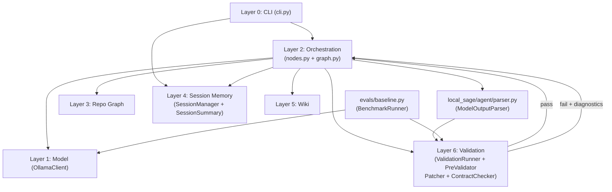
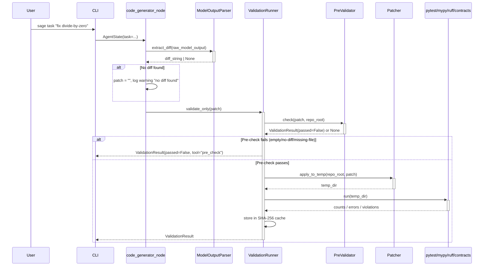
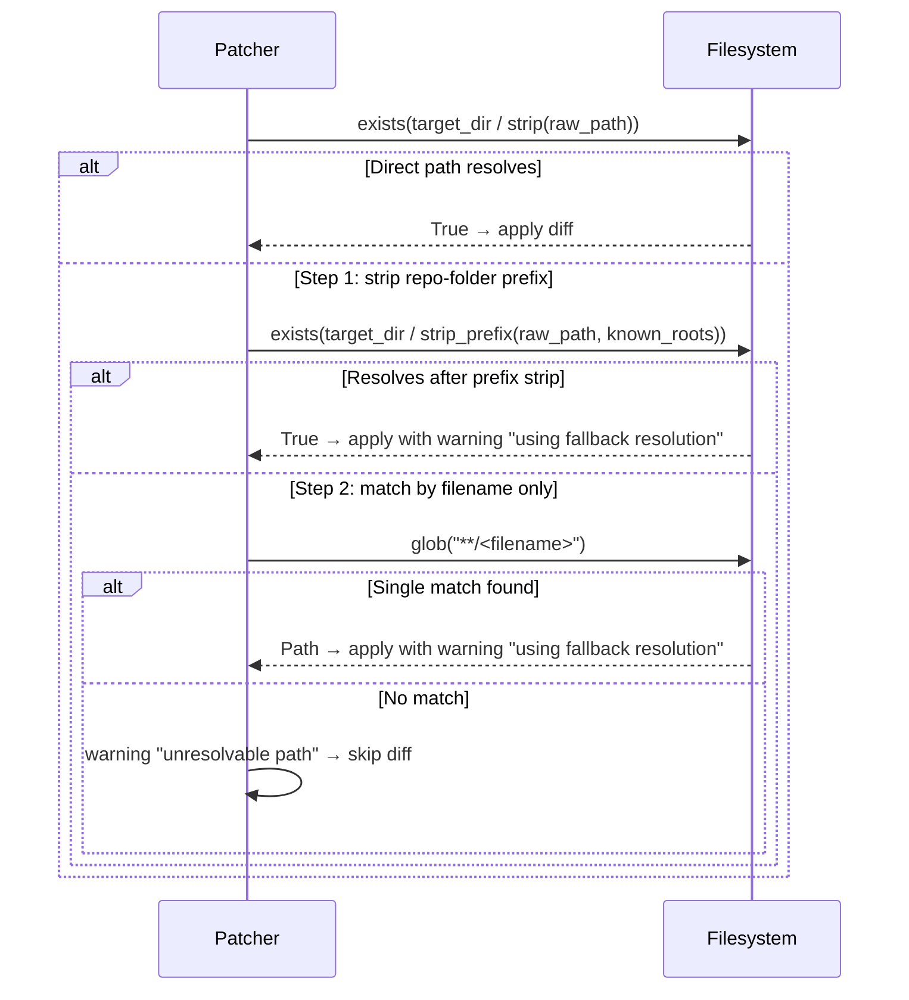
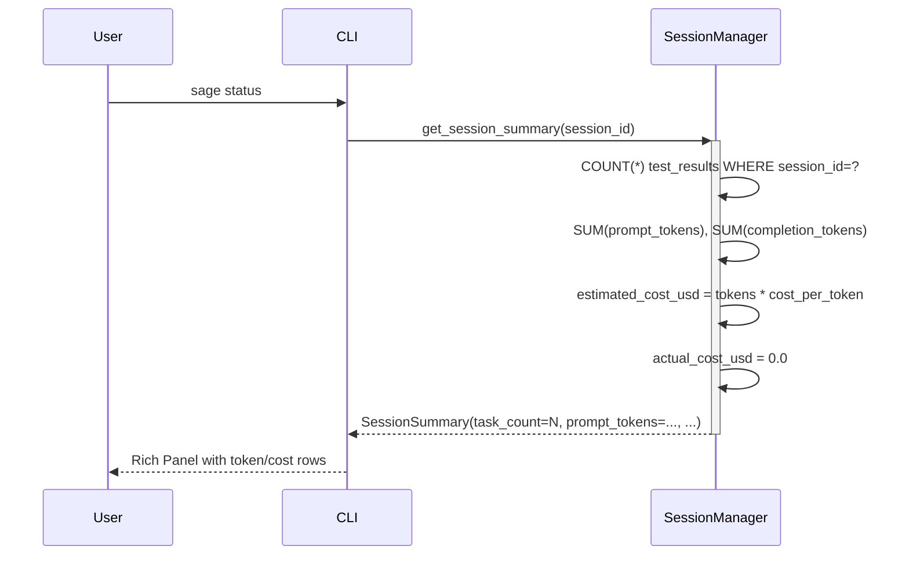

# Design Document — Post-Setup Verification Improvement Sprint

## Overview

This sprint hardens the local-sage agent across six interconnected areas: patch path resolution,
model output parsing, session memory correctness, benchmark infrastructure, validation gate
pre-checking, and documentation. The unifying goal is to raise reliability so the full 20-task
benchmark suite can run end-to-end and produce meaningful pass-rate metrics.

All changes are additive — no existing public interfaces are broken. New components (`ModelOutputParser`,
`PreValidator`, `BenchmarkRunner`) are introduced as distinct modules; existing modules (`Patcher`,
`ValidationRunner`, `SessionManager`) receive targeted augmentations. The validation layer retains
its manual-review requirement for all implementation work.

Every change sits inside the existing six-layer architecture. The new `local_sage/agent/` sub-package
is the only structural addition; it acts as a thin parsing utility consumed by Layer 2 (Orchestration)
and Layer 6 (Validation).

---

## Architecture

### Layer Map After Sprint



### Modified Components Overview

| Component | Sprint Change |
|---|---|
| `local_sage/validation/patcher.py` | Fallback path resolution strategies + `PatchError` raise on empty diff |
| `local_sage/validation/exceptions.py` | New `PatchError` class |
| `local_sage/validation/result.py` | `to_retry_prompt()` appends diff-format hint on empty-patch ruff failures |
| `local_sage/validation/contracts.py` | `_check_exception_types` and `_check_return_shape` return `ContractFailure` instead of warning on missing source file |
| `local_sage/validation/runner.py` | `PreValidator` pre-check + in-memory SHA-256 result cache |
| `local_sage/memory/session.py` | `record_task()` token args + `SessionSummary` token/cost fields + `task_count` fix |
| `local_sage/orchestration/nodes.py` | `CODE_GENERATOR_SYSTEM_PROMPT` constant + `ModelOutputParser` integration |
| `local_sage/agent/parser.py` | New `ModelOutputParser` class |
| `evals/baseline.py` | New `BenchmarkRunner` class |
| `evals/tasks/*.yaml` | 20 task YAML files |
| `evals/repos/fixtures/` | `simple_api/` + `data_processor/` fixture repos |
| `pyproject.toml` | `filterwarnings` for LangGraph/LangChain deprecation warnings |
| `README.md` | Structured documentation |
| `docs/demo_script.md` | Asciinema recording guide |

---

## Sequence Diagrams

### Sequence 1: `sage task` — Happy Path With Pre-Validation and Caching



### Sequence 2: Patch Path Fallback Resolution



### Sequence 3: `sage status` With Token/Cost Fields



---

## Components and Interfaces

### New Component: `ModelOutputParser` (`local_sage/agent/parser.py`)

**Purpose**: Extract a clean unified diff from raw model output regardless of surrounding prose or code fences.

**Interface**:
```python
class ModelOutputParser:
    def extract_diff(self, raw: str) -> str | None:
        """Return the diff substring, or None if no recognizable diff found."""
```

**Extraction priority** (first match wins):
1. `raw` starts with `---` → return `raw` unchanged.
2. ` ```diff ` code fence → extract content between fences.
3. Plain ` ``` ` code fence containing `---` → extract content between fences.
4. First line that starts with `---` followed by `+++` → extract from that line onward.
5. No match → return `None`.

**Responsibilities**:
- Pure string processing, no I/O.
- Stateless — all logic in `extract_diff()`.
- No dependency on any other `local_sage` layer (only stdlib).

---

### Modified Component: `Patcher` (`local_sage/validation/patcher.py`)

**New method: `_resolve_file_path(raw_path, target_dir)`**

```python
def _resolve_file_path(self, raw_path: str, target_dir: Path) -> Path | None:
    """Attempt direct resolution then two fallback strategies.
    
    Returns resolved Path or None if all strategies fail.
    Emits logger.warning containing "Patch path", raw_path, "using fallback resolution"
    when a fallback succeeds.
    """
```

**Fallback strategy order**:

| Step | Strategy | Warning emitted? |
|---|---|---|
| 0 | Strip `a/` or `b/` prefix, resolve directly | No |
| 1 | Strip everything before first occurrence of a known root (`local_sage/`, `tests/`, `evals/`, `wiki/`, `contracts/`) | Yes |
| 2 | Match by filename only via `target_dir.rglob(filename)` | Yes |
| — | No match → skip diff | Yes (unresolvable) |

**New `PatchError` raise in `_apply_patch()`**:

```python
def _apply_patch(self, target_dir: Path, patch: str) -> None:
    diffs = list(whatthepatch.parse_patch(patch))
    if not diffs:
        raise PatchError(
            "No valid diff hunks found in patch — the model likely produced explanation text "
            "instead of a unified diff",
            patch_preview=patch[:200],
        )
    for diff in diffs:
        ...
```

---

### New Exception: `PatchError` (`local_sage/validation/exceptions.py`)

```python
class PatchError(ValidationError):
    """Raised when whatthepatch.parse_patch() returns an empty list.

    Attributes:
        patch_preview: First 200 characters of the bad patch string.
    """
    def __init__(self, message: str, patch_preview: str) -> None:
        super().__init__(message)
        self.patch_preview = patch_preview
```

**Importable as**: `from local_sage.validation.exceptions import PatchError`

---

### Modified Component: `ValidationRunner` (`local_sage/validation/runner.py`)

#### Pre-Validation Gate (`PreValidator`)

Pre-check logic is implemented as a private method `_pre_validate(patch: str) -> ValidationResult | None`
called at the top of both `validate_and_apply()` and `validate_only()`, before `apply_to_temp()`.

```python
def _pre_validate(self, patch: str) -> ValidationResult | None:
    """Run fast pre-checks. Returns a failed ValidationResult on failure, None on pass.
    
    Completes in < 100 ms for any patch up to 100,000 characters.
    """
```

**Pre-check rules (evaluated in order, first failure returned)**:

| Rule | Failure `message` contains |
|---|---|
| `patch.strip() == ""` | `"empty patch"` |
| `ModelOutputParser().extract_diff(patch) is None` | `"no valid diff found"` |
| No lines starting with `+` or `-` (excluding `---`/`+++`) | `"no change lines"` |
| Any file path in the diff does not exist under `self._repo_root` | `"<missing_path>"` |

All failures produce a `ValidationResult(passed=False, failures=[ValidationFailure(tool="pre_check", message=...)])`.

#### Result Cache

```python
# In __init__():
self._cache: dict[str, ValidationResult] = {}

# Cache key:
import hashlib
key = hashlib.sha256(patch.encode()).hexdigest()[:16]
```

Cache is cleared at the start of `validate_and_apply()` (not `validate_only()`). Each `ValidationRunner`
instance has its own independent cache — no class-level sharing.

**Updated `validate_and_apply()` skeleton**:

```python
def validate_and_apply(self, patch: str) -> ValidationResult:
    self._cache.clear()                        # fresh cache per apply cycle
    pre = self._pre_validate(patch)
    if pre is not None:
        return pre
    key = hashlib.sha256(patch.encode()).hexdigest()[:16]
    if key in self._cache:
        return self._cache[key]
    temp_dir = self._patcher.apply_to_temp(self._repo_root, patch)
    try:
        result = self._run_all_checks(temp_dir)
        self._cache[key] = result
        if result.passed:
            if self._manual_review and not self._prompt_manual_review(result):
                return result
            self._patcher.apply_to_repo(self._repo_root, patch)
        return result
    finally:
        self._patcher.revert(temp_dir)
```

---

### Modified Component: `ValidationResult` (`local_sage/validation/result.py`)

`to_retry_prompt()` gains a new note when the only failure is a ruff FORMAT-only failure — which is
the fingerprint of "model returned explanation text, ruff tried to lint it as Python and only found
formatting issues".

```python
def _append_diff_format_note(self) -> str | None:
    """Return a diff-format hint string if the failure pattern matches FORMAT-only ruff."""
    ruff_only = (
        len(self.failures) == 1
        and self.failures[0].tool == "ruff"
        and self.ruff_violations is not None
        and all(v.rule_code == "FORMAT" for v in self.ruff_violations)
    )
    if not ruff_only:
        return None
    return (
        "\nNOTE: The model likely produced explanation text instead of a unified diff.\n"
        "Output ONLY a unified diff in this exact format:\n"
        "  --- a/file\n"
        "  +++ b/file\n"
        "  @@ ... @@ hunks\n"
        "  -old line\n"
        "  +new line\n"
    )
```

---

### Modified Component: `ContractChecker` (`local_sage/validation/contracts.py`)

Both `_check_exception_types()` and `_check_return_shape()` now return a `ContractFailure` (instead of
an empty list with a warning) when the source file is absent:

```python
# In _check_exception_types():
if not source_path.is_file():
    return [ContractFailure(
        symbol_id=contract.symbol_id,
        constraint="source_file_not_found",
        actual=str(source_path),
    )]

# In _check_return_shape():
if not (repo_dir / contract.source_file).is_file():
    return [ContractFailure(
        symbol_id=contract.symbol_id,
        constraint="source_file_not_found",
        actual=str(repo_dir / contract.source_file),
    )]
```

The `logger.warning` call for the missing-file case is removed from both methods.

---

### Modified Component: `SessionManager` (`local_sage/memory/session.py`)

#### Updated `SessionSummary`

```python
@dataclass
class SessionSummary:
    task_count: int
    patch_count: int
    last_active: datetime
    observations: list[str]
    # New fields:
    prompt_tokens: int
    completion_tokens: int
    estimated_cost_usd: float
    actual_cost_usd: float   # always 0.0
```

#### Updated `record_task()` signature

```python
def record_task(
    self,
    session_id: str,
    task: str,
    patch: str,
    result: ValidationResult,
    prompt_tokens: int = 0,
    completion_tokens: int = 0,
) -> None:
    """Persist one completed task to test_results.
    
    Inserts exactly one row per call. task_count is derived from COUNT(*).
    """
```

The `task_count` in `get_session_summary()` is computed via:

```sql
SELECT COUNT(*) FROM test_results WHERE session_id = ?
```

#### Token Aggregation in `get_session_summary()`

```sql
SELECT COALESCE(SUM(prompt_tokens), 0),
       COALESCE(SUM(completion_tokens), 0)
FROM   test_results
WHERE  session_id = ?
```

`estimated_cost_usd = (prompt_tokens + completion_tokens) * COST_PER_TOKEN`
where `COST_PER_TOKEN` is a module-level constant (e.g. `0.000_002` USD per token as a proxy rate).
`actual_cost_usd` is always `0.0`.

The `test_results` table schema gains two new optional integer columns:

```sql
ALTER TABLE test_results ADD COLUMN prompt_tokens    INTEGER NOT NULL DEFAULT 0;
ALTER TABLE test_results ADD COLUMN completion_tokens INTEGER NOT NULL DEFAULT 0;
```

---

### Modified Component: `nodes.py` (`local_sage/orchestration/nodes.py`)

```python
CODE_GENERATOR_SYSTEM_PROMPT: str = (
    "You are an expert Python engineer. "
    "Output ONLY a unified diff in git diff format. "
    "No explanation. No markdown code fences. No commentary. "
    "Every line must start with one of: ---, +++, @@, ' ' (space/context), '+', or '-'. "
    "Begin your response with '--- a/' immediately."
)
```

`code_generator_node` is updated to:
1. Pass `CODE_GENERATOR_SYSTEM_PROMPT` as the `system` argument to `OllamaClient.generate()`.
2. Pass the raw response text through `ModelOutputParser().extract_diff()`.
3. If `extract_diff()` returns `None`: set `patch = ""`, log `logger.warning("no diff found in model output")`.

---

### New Component: `BenchmarkRunner` (`evals/baseline.py`)

**Purpose**: Measure raw Ollama performance with zero scaffolding as a comparison baseline.

**Interface**:

```python
class BenchmarkRunner:
    def __init__(self, tasks_dir: Path, repos_dir: Path) -> None: ...
    def run_all(self) -> BenchmarkReport: ...
    def run_task(self, task: dict[str, Any]) -> TaskResult: ...
    def _call_ollama(self, task_description: str) -> str: ...
    def _evaluate(self, response: str, task: dict[str, Any], repos_dir: Path) -> bool: ...
```

**Behavior**:
- Calls `http://localhost:11434/api/generate` directly via `httpx` (no `OllamaClient` wrapping).
- All scaffolding features are explicitly disabled: no repo graph, no session memory, no wiki context,
  no retry loop.
- Applies the response to a fresh temp copy via `Patcher.apply_to_temp()`.
- Runs pytest, mypy, and ruff against the temp copy; records pass/fail per task.
- Uses the identical `BenchmarkReport` / `TaskResult` schema from `evals/runner.py`.
- Accepts `--tasks-dir` and `--repos-dir` CLI arguments with the same defaults as `evals/runner.py`.
- Prints a report using the same `print_report()` function from `evals/runner.py`.

---

## Data Models

### `PatchError` (new)

```python
@dataclass  # conceptual — actual implementation is Exception subclass
class PatchError:
    message: str               # contains "No valid diff hunks found in patch" and "explanation text"
    patch_preview: str         # first 200 chars of the bad patch string
```

### Updated `SessionSummary`

```python
@dataclass
class SessionSummary:
    task_count: int            # COUNT(*) from test_results
    patch_count: int           # COUNT(*) from file_changes
    last_active: datetime
    observations: list[str]
    prompt_tokens: int         # SUM(prompt_tokens) from test_results
    completion_tokens: int     # SUM(completion_tokens) from test_results
    estimated_cost_usd: float  # (prompt + completion) * COST_PER_TOKEN
    actual_cost_usd: float     # always 0.0
```

### Task YAML Schema (20 files under `evals/tasks/`)

```yaml
id: "contract_violation_01"           # str, unique
category: "contract_violation"        # one of four CATEGORIES
description: "Fix the OllamaClient to only raise OllamaError subclasses"
repo: "simple_api"                    # relative to evals/repos/fixtures/
expected_files_changed:
  - "local_sage/model/client.py"
pass_condition: "pytest tests/model/test_client.py -x"
```

### Fixture Repository Structure

```
evals/repos/fixtures/
├── simple_api/
│   ├── pyproject.toml          # minimal Python project
│   ├── simple_api/
│   │   └── core.py             # intentional bug
│   ├── tests/
│   │   ├── test_before.py      # fails before fix
│   │   └── test_after.py       # passes after fix
│   └── contracts/
│       └── core_contract.yaml
└── data_processor/
    ├── pyproject.toml
    ├── data_processor/
    │   └── processor.py        # intentional bug
    ├── tests/
    │   ├── test_before.py
    │   └── test_after.py
    └── contracts/
        └── processor_contract.yaml
```

---

## Algorithmic Pseudocode

### Algorithm 1: `Patcher._resolve_file_path()`

```pascal
ALGORITHM _resolve_file_path(raw_path, target_dir)
INPUT:  raw_path of type string
        target_dir of type Path
OUTPUT: resolved_path of type Path | None

BEGIN
  // Step 0: strip leading a/ or b/ prefix
  clean ← raw_path.lstrip("ab/")
  candidate ← target_dir / clean
  IF candidate.exists() THEN
    RETURN candidate
  END IF

  // Step 1: strip everything before a known top-level root
  known_roots ← ["local_sage/", "tests/", "evals/", "wiki/", "contracts/"]
  FOR each root IN known_roots DO
    idx ← raw_path.find(root)
    IF idx >= 0 THEN
      relative ← raw_path[idx:]
      candidate ← target_dir / relative
      IF candidate.exists() THEN
        EMIT logger.warning("Patch path", raw_path, "using fallback resolution")
        RETURN candidate
      END IF
    END IF
  END FOR

  // Step 2: match by filename only
  filename ← Path(clean).name
  matches ← list(target_dir.rglob(filename))
  IF len(matches) = 1 THEN
    EMIT logger.warning("Patch path", raw_path, "using fallback resolution")
    RETURN matches[0]
  END IF

  // All strategies exhausted
  EMIT logger.warning("unresolvable path", raw_path)
  RETURN None
END
```

**Preconditions:**
- `raw_path` is a non-empty string from the diff header.
- `target_dir` is an existing directory.

**Postconditions:**
- Returns an existing `Path` or `None`.
- If a fallback was used, a warning containing `"Patch path"`, `raw_path`, and `"using fallback resolution"` has been emitted.
- The resolved path, if returned, exists on disk (`path.exists() == True`).

**Loop Invariants:**
- After each known-root iteration, only roots not yet tried remain.

---

### Algorithm 2: `ValidationRunner._pre_validate()`

```pascal
ALGORITHM _pre_validate(patch)
INPUT:  patch of type string
OUTPUT: result of type ValidationResult | None

PRECONDITION: len(patch) <= 100_000
BEGIN
  // Rule 1: empty patch
  IF patch.strip() = "" THEN
    RETURN failed_result(tool="pre_check", message="empty patch")
  END IF

  // Rule 2: no recognizable diff
  diff_str ← ModelOutputParser().extract_diff(patch)
  IF diff_str IS None THEN
    RETURN failed_result(tool="pre_check", message="no valid diff found")
  END IF

  // Rule 3: no change lines
  has_changes ← FALSE
  FOR each line IN patch.splitlines() DO
    IF (line starts with "+" OR line starts with "-") AND
       (NOT line starts with "---") AND (NOT line starts with "+++") THEN
      has_changes ← TRUE
      BREAK
    END IF
  END FOR
  IF NOT has_changes THEN
    RETURN failed_result(tool="pre_check", message="no change lines")
  END IF

  // Rule 4: missing file paths
  FOR each diff IN whatthepatch.parse_patch(patch) DO
    raw ← diff.header.new_path OR diff.header.old_path
    resolved ← _resolve_file_path(raw, self._repo_root)
    IF resolved IS None THEN
      RETURN failed_result(tool="pre_check", message=str(raw))
    END IF
  END FOR

  RETURN None   // all pre-checks pass
END
```

**Preconditions:**
- `patch` is a string (may be empty or malformed).
- `self._repo_root` is a valid directory.

**Postconditions:**
- Returns `None` when all checks pass (caller proceeds to full validation).
- Returns a `ValidationResult(passed=False)` on the first rule violation.
- Completes in < 100 ms for any patch ≤ 100,000 characters.

**Loop Invariants:**
- The `has_changes` flag monotonically transitions from `False` to `True`.

---

### Algorithm 3: `ModelOutputParser.extract_diff()`

```pascal
ALGORITHM extract_diff(raw)
INPUT:  raw of type string
OUTPUT: diff of type string | None

BEGIN
  // Priority 1: raw diff (starts with ---)
  IF raw.lstrip() starts with "---" THEN
    RETURN raw
  END IF

  // Priority 2: ```diff code fence
  IF "```diff" IN raw THEN
    start ← raw.index("```diff") + len("```diff\n")
    end   ← raw.index("```", start)
    RETURN raw[start:end].strip()
  END IF

  // Priority 3: plain ``` fence containing ---
  IF "```" IN raw THEN
    first_fence ← raw.index("```")
    after_fence ← first_fence + 3
    // skip optional language tag on same line
    newline_after ← raw.index("\n", after_fence)
    content_start ← newline_after + 1
    closing_fence ← raw.index("```", content_start)
    content ← raw[content_start:closing_fence]
    IF "---" IN content THEN
      RETURN content.strip()
    END IF
  END IF

  // Priority 4: scan for first line starting with ---
  lines ← raw.splitlines()
  FOR i, line IN enumerate(lines) DO
    IF line starts with "---" THEN
      // confirm next non-empty line starts with +++
      FOR j IN range(i+1, len(lines)) DO
        IF lines[j].strip() ≠ "" THEN
          IF lines[j] starts with "+++" THEN
            RETURN "\n".join(lines[i:])
          ELSE
            BREAK
          END IF
        END IF
      END FOR
    END IF
  END FOR

  RETURN None
END
```

**Preconditions:**
- `raw` is any string (may be empty).

**Postconditions:**
- Returns a string if any diff-like content is found.
- Returns `None` only when no diff indicator is detected.
- Never raises an exception.

---

### Algorithm 4: SHA-256 Result Cache in `ValidationRunner`

```pascal
ALGORITHM validate_and_apply_with_cache(patch)
BEGIN
  self._cache.clear()                     // fresh per top-level call

  pre ← _pre_validate(patch)
  IF pre IS NOT None THEN RETURN pre END IF

  key ← sha256(patch.encode()).hexdigest()[:16]
  IF key IN self._cache THEN
    RETURN self._cache[key]
  END IF

  temp_dir ← _patcher.apply_to_temp(repo_root, patch)
  TRY
    result ← _run_all_checks(temp_dir)
    self._cache[key] ← result
    IF result.passed THEN
      IF _manual_review AND NOT _prompt_manual_review(result) THEN
        RETURN result
      END IF
      _patcher.apply_to_repo(repo_root, patch)
    END IF
    RETURN result
  FINALLY
    _patcher.revert(temp_dir)
  END TRY
END
```

**Preconditions:**
- `self._cache` is an instance-level dict (never shared across instances).

**Postconditions:**
- `self._cache` contains the result for `key` after a full validation run.
- `apply_to_repo` is called if and only if `result.passed == True` and manual review is confirmed.

**Loop Invariants:** N/A (no loops in this algorithm).

---

## Key Functions with Formal Specifications

### `ModelOutputParser.extract_diff(raw: str) -> str | None`

**Preconditions:**
- `raw` is defined (not None).

**Postconditions:**
- If `raw.lstrip().startswith("---")` then `result == raw`.
- If result is not None, `"---" in result`.
- If result is None, no diff-like pattern was found in `raw`.
- No side effects; `raw` is not mutated.

---

### `Patcher._resolve_file_path(raw_path: str, target_dir: Path) -> Path | None`

**Preconditions:**
- `raw_path` is a non-empty string.
- `target_dir` is an existing directory.

**Postconditions:**
- If result is not None, `result.exists() == True`.
- If a fallback strategy was used, `logger.warning` was called with `"Patch path"`, `raw_path`, and `"using fallback resolution"` in the message.
- If result is None, a warning identifying the unresolvable path was emitted.

---

### `ValidationRunner._pre_validate(patch: str) -> ValidationResult | None`

**Preconditions:**
- `patch` is a string, `len(patch) <= 100_000`.
- `self._repo_root` is a valid, existing directory.

**Postconditions:**
- Returns `None` if and only if all four pre-check rules pass.
- Returns a `ValidationResult(passed=False, failures=[ValidationFailure(tool="pre_check", ...)])` on first rule violation.
- Completes in < 100 ms.
- Does not touch the filesystem (no temp directories created).

---

### `SessionManager.get_session_summary(session_id: str) -> SessionSummary`

**Preconditions:**
- `session_id` is a valid string (may not exist in the database).

**Postconditions:**
- `result.task_count == COUNT(*) FROM test_results WHERE session_id = session_id`.
- `result.task_count == 0` if `record_task()` was never called for this session.
- `result.actual_cost_usd == 0.0` always.
- `result.estimated_cost_usd == (result.prompt_tokens + result.completion_tokens) * COST_PER_TOKEN`.

---

## Example Usage

```python
# --- ModelOutputParser ---
parser = ModelOutputParser()

# Raw diff
raw = "--- a/local_sage/model/client.py\n+++ b/local_sage/model/client.py\n@@ -10,1 +10,1 @@\n-    pass\n+    return None\n"
assert parser.extract_diff(raw) == raw

# Wrapped in ```diff fence
fenced = "Here is the fix:\n```diff\n--- a/foo.py\n+++ b/foo.py\n@@ -1,1 +1,1 @@\n-x=1\n+x=2\n```\n"
result = parser.extract_diff(fenced)
assert result is not None and result.startswith("---")

# No diff → None
assert parser.extract_diff("This looks like a good fix to me.") is None

# --- PreValidator via ValidationRunner ---
runner = ValidationRunner(repo_root=Path("/my/repo"))
result = runner.validate_only("")          # empty patch
assert result.passed is False
assert result.failures[0].tool == "pre_check"
assert "empty patch" in result.failures[0].message

# --- SessionManager with token tracking ---
sm = SessionManager(db_path=Path(".sage/memory.db"))
session_id = sm.create_session(Path.cwd())
sm.record_task(session_id, "add logging", "--- a/foo.py...", result, prompt_tokens=150, completion_tokens=300)
summary = sm.get_session_summary(session_id)
assert summary.task_count == 1
assert summary.prompt_tokens == 150
assert summary.completion_tokens == 300
assert summary.actual_cost_usd == 0.0

# --- PatchError ---
from local_sage.validation.exceptions import PatchError
from local_sage.validation.patcher import Patcher
patcher = Patcher()
try:
    patcher._apply_patch(Path("/tmp/repo"), "this is explanation text, not a diff")
except PatchError as exc:
    assert "No valid diff hunks found in patch" in exc.message
    assert len(exc.patch_preview) <= 200
```

---

## Correctness Properties

### Property 1: Fallback path resolution never silently discards a resolvable diff

For any `raw_path` string and `target_dir`, if `_resolve_file_path(raw_path, target_dir)` returns a
`Path`, then `path.exists()` is `True` and the diff is applied. If it returns `None`, a warning is
emitted and the diff is skipped without raising.

**Validates: Requirements 1.1, 1.2, 1.3, 1.4**

### Property 2: Pre-validation never allows an empty patch to reach `apply_to_temp`

For any empty or whitespace-only `patch` string, `ValidationRunner.validate_only()` and
`ValidationRunner.validate_and_apply()` SHALL return a `ValidationResult(passed=False)` whose first
failure has `tool == "pre_check"` and `message` contains `"empty patch"`, without calling
`Patcher.apply_to_temp()`.

**Validates: Requirements 13.1, 13.4**

### Property 3: SHA-256 cache does not affect result correctness

For any patch string `p`, calling `validate_only(p)` twice on the same `ValidationRunner` instance
returns an identical `ValidationResult` both times (same `passed`, `failures`, `pytest_counts`,
`mypy_errors`, `ruff_violations`, `contract_failures`).

**Validates: Requirements 14.2, 14.5**

### Property 4: `task_count` equals the number of `record_task` calls

For any session, after exactly `N` calls to `SessionManager.record_task()` with the same `session_id`,
`SessionManager.get_session_summary(session_id).task_count == N`.

**Validates: Requirements 5.1, 5.2, 5.3, 5.4**

### Property 5: `actual_cost_usd` is always zero

For any session with any number of tasks, `SessionSummary.actual_cost_usd == 0.0`.

**Validates: Requirements 12.5**

### Property 6: `PatchError` message always contains both required substrings

For any non-diff string `s` that produces an empty list from `whatthepatch.parse_patch(s)`, calling
`Patcher._apply_patch(any_dir, s)` raises a `PatchError` whose `message` contains both
`"No valid diff hunks found in patch"` and `"explanation text"`.

**Validates: Requirements 2.1, 2.2**

### Property 7: `ContractChecker` never silently passes a missing source file

For any `contract` whose `source_file` does not exist under `repo_dir`, both
`_check_exception_types(contract, repo_dir)` and `_check_return_shape(contract, repo_dir)` return
a non-empty list containing a `ContractFailure` with `constraint == "source_file_not_found"`.

**Validates: Requirements 4.1, 4.2, 4.3**

### Property 8: `ModelOutputParser` is idempotent on raw diffs

For any string `s` that starts with `---`, `ModelOutputParser().extract_diff(s) == s`. Applying
`extract_diff` a second time to the result produces the same output.

**Validates: Requirements 7.2, 7.6**

---

## Error Handling

### Error Scenario 1: Malformed YAML contract file

**Condition**: `ContractChecker.load_contracts()` encounters a YAML file that is not a dict or is
missing `symbol_id` / `exception_types`.
**Response**: Raise `ContractParseError` with the file path and parse error detail.
**Recovery**: `ContractChecker.check()` propagates the exception; `ValidationRunner._run_contracts()`
appends a `ValidationFailure(tool="contracts", ...)` so the agent can retry.

### Error Scenario 2: All patch path fallback strategies fail

**Condition**: A diff's `raw_path` cannot be resolved by any of the three strategies.
**Response**: `_apply_single_diff()` logs a warning and skips that diff.
**Recovery**: The rest of the patch application continues. Downstream validators will catch any
inconsistency (e.g., pytest failure because the file was not updated).

### Error Scenario 3: Ollama returns plain text instead of a diff

**Condition**: `OllamaClient.generate()` returns explanation text; `extract_diff()` returns `None`.
**Response**: `code_generator_node` sets `patch = ""` and logs `"no diff found"`.
**Recovery**: `ValidationRunner._pre_validate()` immediately returns a `pre_check` failure with
`"no valid diff found"`. The orchestration retry loop re-prompts the model with the diff-format note
appended to the prompt.

### Error Scenario 4: `record_task()` database write failure

**Condition**: SQLite write raises an exception.
**Response**: `memory_writer_node` catches `Exception` and logs a warning (existing behavior).
**Recovery**: Agent continues; the task is not counted in `task_count` for that session (acceptable
degradation — task was still applied to the repo if validation passed).

### Error Scenario 5: Fixture repo missing during benchmark

**Condition**: `BenchmarkRunner.run_task()` cannot find the fixture repo path.
**Response**: Return `TaskResult(passed=False, error="Fixture repo not found: <path>")`.
**Recovery**: Benchmark runner continues with remaining tasks; the missing-repo task shows `FAIL`
in the report.

---

## Testing Strategy

### Unit Testing Approach

Every new class and modified method has a corresponding unit test file following the mirror convention:
- `local_sage/agent/parser.py` → `tests/agent/test_parser.py`
- `local_sage/validation/exceptions.py` (PatchError) → existing `tests/validation/test_exceptions.py`
- `local_sage/validation/patcher.py` (fallback + PatchError) → `tests/validation/test_patcher.py` (extended)
- `local_sage/validation/runner.py` (PreValidator + cache) → `tests/validation/test_runner.py` (extended)
- `local_sage/validation/result.py` (diff-format note) → `tests/validation/test_result.py` (extended)
- `local_sage/memory/session.py` (token fields) → `tests/memory/test_session.py` (extended)
- `local_sage/orchestration/nodes.py` (prompt constant) → `tests/orchestration/test_nodes.py` (extended)
- `evals/baseline.py` → `tests/integration/test_baseline.py` (requires `SAGE_INTEGRATION=true`)

### Property-Based Testing Approach

**Property Test Library**: `hypothesis>=6.0` (already in dev dependencies)

New property-based tests augment the existing suite:

| Test | Property | Strategy |
|---|---|---|
| `test_extract_diff_raw_diff_identity` | Property H: raw diffs returned unchanged | `st.text()` prefixed with `"--- a/"` |
| `test_extract_diff_returns_none_or_contains_diff_marker` | extract_diff result always contains `---` if not None | `st.text()` |
| `test_pre_validate_empty_always_fails` | Property B: empty/whitespace patch never reaches apply_to_temp | `st.text(max_size=1000).filter(lambda s: not s.strip())` |
| `test_task_count_equals_record_count` | Property D: task_count matches call count | `st.integers(min_value=0, max_value=20)` |
| `test_actual_cost_always_zero` | Property E: actual_cost_usd == 0.0 | `st.integers(min_value=0, max_value=100_000)` for token counts |
| `test_patcher_fallback_never_returns_nonexistent_path` | Property A: resolved path always exists | `patch_strategy()` + `tmp_path` |

### Integration Testing Approach

Integration tests (gated by `SAGE_INTEGRATION=true`) cover:
- `BenchmarkRunner` end-to-end against fixture repos with a live Ollama server.
- `ValidationRunner.validate_and_apply()` on a real temp directory with real subprocess calls.

---

## Performance Considerations

- **Pre-validation budget**: All four pre-check rules operate on the patch string in memory. For the
  largest realistic patch (100,000 characters ≈ 3,000 lines), the `splitlines()` scan is O(n). The
  `whatthepatch.parse_patch()` call is the most expensive step; it completes in < 5 ms for inputs of
  this size. Total budget: < 100 ms.
- **SHA-256 cache**: `hashlib.sha256` on a 100 KB string takes < 1 ms. The cache lookup is O(1).
  Memory cost is bounded by the number of unique patches in a single `validate_and_apply()` call
  (in practice, 1–3 variants per agent task).
- **`shutil.copytree` in `apply_to_temp()`**: Unchanged. This is the dominant cost in the validation
  pipeline (~1–2 s for a typical Python repo). The pre-validation gate eliminates this cost entirely
  for obviously bad patches.
- **Token tracking**: Two additional `INTEGER` columns in `test_results`. No index change needed;
  the existing `session_id` filter is sufficient for aggregate queries on < 1,000 rows per session.

---

## Security Considerations

- **`whatthepatch` path traversal**: `Patcher._resolve_file_path()` resolves paths only within
  `target_dir`. The fallback strategies (`rglob`) are also scoped to `target_dir`. No path can
  escape the temp directory.
- **SHA-256 cache key**: Using only the first 16 hex characters (64-bit prefix) provides sufficient
  collision resistance for the bounded set of patches within a single agent run (< 10 patches).
  A collision would only cause a cached result to be returned, not a security breach.
- **`BenchmarkRunner` Ollama calls**: All HTTP requests target `localhost:11434` exclusively,
  consistent with the no-external-API-calls constraint.
- **`PatchError.patch_preview`**: Limited to 200 characters to avoid exposing unexpectedly large
  model outputs in error messages or logs.

---

## Dependencies

No new runtime dependencies are introduced. All components use:
- `whatthepatch>=1.0.4` (already in `pyproject.toml`) — `Patcher` fallback + `PatchError`.
- `hashlib` (stdlib) — SHA-256 cache key in `ValidationRunner`.
- `httpx==0.27.*` (already in `pyproject.toml`) — `BenchmarkRunner` direct Ollama calls.
- `hypothesis>=6.0` (already in dev deps) — new property-based tests.
- `pyyaml` (transitive via `mem0ai`) — already available for `evals/runner.py` and `evals/baseline.py`.

The `local_sage/agent/` sub-package is a new directory. It requires:
- A `local_sage/agent/__init__.py` exporting `ModelOutputParser`.
- A corresponding `tests/agent/__init__.py` and `tests/agent/test_parser.py`.
